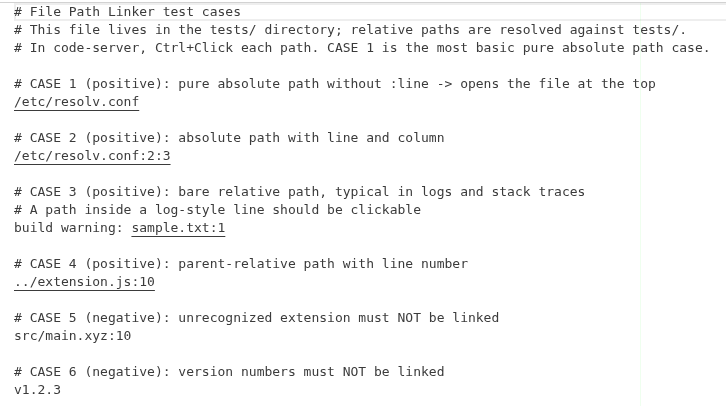

# File Path Linker

这是一个 VS Code / code-server 扩展。

让任意编辑器文件里的文件路径（可带 `:行` / `:行:列`）变成可点击跳转的链接。
任何语言或纯文本文件中，像 `/abs/path/file.ext:12`、`./rel/file.js`、`../up/file.ts:3:5`、
`C:\path\file.txt` 这样的路径都可以 Ctrl+点击，直接打开目标文件并跳到指定行（和列）。



## 特性

- 对所有语言生效（`*` 作用域）注册一个 `DocumentLinkProvider`。
- 匹配绝对路径、相对路径（`./`、`../`）以及 Windows 盘符路径（`C:\...`）。
- 支持可选的 `:行` 与 `:行:列` 后缀。
- 相对路径按**当前阅读文件所在目录**解析，而不是工作区根目录。
- 用负向后行断言避免把 URL（`http://...`）或代码标识符误判成链接；只有带已知文件扩展名
  （或以 `/`、`\` 结尾的目录）才会被链接化。

## 安装

### code-server

```bash
mkdir -p ~/.local/share/code-server/extensions/file-path-linker
cp package.json extension.js ~/.local/share/code-server/extensions/file-path-linker/
```

然后重载窗口：`Ctrl+Shift+P` -> `Developer: Reload Window`。

### VS Code（桌面版）

把 `package.json` 和 `extension.js` 复制到扩展目录，例如
`~/.vscode/extensions/file-path-linker/`，然后如同上一步重载窗口。

## 使用

打开任意包含文件路径的文件（`.log`、`.md`、`.txt`、源码等都行），
用 Ctrl+点击（macOS 为 Cmd+点击）路径即可跳转。

支持的形式：

```text
/path/to/file.js          打开文件
/path/to/file.js:42       打开并定位到第 42 行
/path/to/file.js:42:10    打开并定位到第 42 行第 10 列
./relative/file.py:7      按当前文件所在目录解析
../up/file.ts             父级相对路径
C:\path\file.txt          Windows 盘符路径
```

如果目标文件不存在，会提示报错信息。

## 原理

- `extension.js` 注册一个面向 `*` 语言作用域的文档链接提供器，并在 `provideDocumentLinks`
  时扫描全文中的路径-like 字符串。
- 用单一正则完成匹配，并捕获可选的 `:行` 与 `:行:列`。
- 每个匹配生成一个 `command:filePathLinker.open?{...}` 链接；点击后由命令将相对路径按
  当前文件目录解析并打开目标，带行/列则跳过去。

## 测试

`tests/` 目录包含：

- `run-regex-test.js` - 与生产正则保持一致的自动化校验，逐行报告匹配结果。
- `test_links.txt` - 手动 Ctrl+点击用例（绝对路径、相对路径、负向用例）。
- `sample.txt` - 供裸相对路径用例跳转的小目标文件。

运行自动化校验：

```bash
node tests/run-regex-test.js
```

## 许可证

MIT